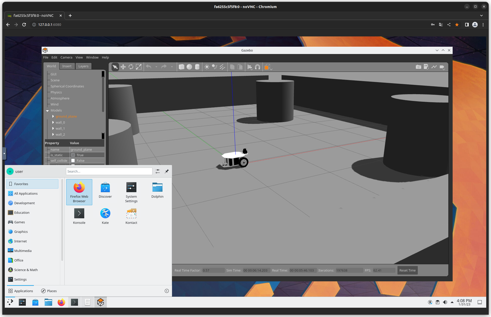

# nvidia-egl-desktop-ros2

## Introduction

This is a Dockerfile to use ROS2 on KDE Plasma Desktop container with NVIDIA GPU.  
This Dockerfile is based on [selkies-project/docker-nvidia-egl-desktop](https://github.com/selkies-project/docker-nvidia-egl-desktop).



If you are interested in ROS1 version, please check [atinfinity/nvidia-egl-desktop-ros](https://github.com/atinfinity/nvidia-egl-desktop-ros).

## Requirements

- NVIDIA graphics driver 450.80.02+ [^1]
- Docker
- nvidia-docker2

## Build docker image

### ROS2 Foxy

```
cd foxy
docker build -t nvidia-egl-desktop-ros2:foxy .
```

### ROS2 Galactic

```
cd galactic
docker build -t nvidia-egl-desktop-ros2:galactic .
```

### ROS2 Humble

```
cd humble
docker build -t nvidia-egl-desktop-ros2:humble .
```

## Launch docker container

Execute the command described below.  
If you customize setting, please read <https://github.com/selkies-project/docker-nvidia-egl-desktop/blob/main/README.md>.

### ROS2 Foxy

```
docker run --gpus 1 -it --shm-size=1024m -e SIZEW=1920 -e SIZEH=1080 -e PASSWD=mypasswd -e BASIC_AUTH_PASSWORD=mypasswd -e NOVNC_ENABLE=true -p 6080:8080 nvidia-egl-desktop-ros2:foxy
```

### ROS2 Galactic

```
docker run --gpus 1 -it --shm-size=1024m -e SIZEW=1920 -e SIZEH=1080 -e PASSWD=mypasswd -e BASIC_AUTH_PASSWORD=mypasswd -e NOVNC_ENABLE=true -p 6080:8080 nvidia-egl-desktop-ros2:galactic
```

### ROS2 Humble

```
docker run --gpus 1 -it --shm-size=1024m -e SIZEW=1920 -e SIZEH=1080 -e PASSWD=mypasswd -e BASIC_AUTH_PASSWORD=mypasswd -e NOVNC_ENABLE=true -p 6080:8080 nvidia-egl-desktop-ros2:humble
```

### Access KDE Plasma Desktop via web browser

Browse <http://127.0.0.1:6080/>.  
In this docker container, default account is `user`.  
You can set password via `PASSWD` and `BASIC_AUTH_PASSWORD` when you execute `docker run`. The default password is `mypasswd`.  

[^1]: <https://github.com/selkies-project/docker-nvidia-egl-desktop/blob/main/README.md>
